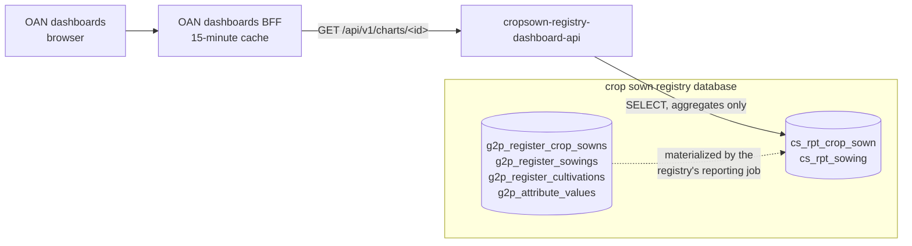

# Architecture

## Where the service sits

- The **dashboards BFF** is the only client. It maps each chart ID to one dashboard service, calls
  it with the dashboard's filters and caches the response.
- This service holds the only credentials for the crop sown registry database that the dashboards
  path uses. It reads only the reporting views and returns aggregates.
- The **reporting views** belong to the crop sown registry, not to this service. The registry's
  db-seed image ships `reporting_views.sql`; its Helm chart applies it on every install and upgrade
  and refreshes the views on a schedule.

## Data sources

| View | Grain | Used for |
| --- | --- | --- |
| `cs_rpt_crop_sown` | one row per farmer-plot-season registration (`g2p_register_crop_sowns`) | registrations by workflow status, lifecycle stage and record status |
| `cs_rpt_sowing` | one row per sowing line (`g2p_register_sowings`), with the registration's geography, status, season and farmer carried down | area, crops, ownership, seasons, trend |

Columns worth knowing:

- `farmer_key`: a one-way hash of the farmer's id. `COUNT(DISTINCT farmer_key)` counts farmers
  without the service ever seeing an id.
- `area_sown_ha`: the area sown, normalised to hectares from the recorded unit (hectare, timad,
  acre, square metre). A missing unit is the form's default, hectares; an unknown unit gives NULL.
- `ownership_type`, `is_owned`: the plot's ownership, captured at the cultivation stage and carried
  onto each sowing line of the registration (preferring the cultivation of the same crop). A
  registration not yet cultivated has none.
- `recorded_on`: the sowing date, or the registration date for a line not sown yet.
- `<level>_name` / `<level>_code` for region, zone, woreda and kebele. A registration stores each
  level as a lookup key (`REGION_ET04`) and its display name; the code is the key without its
  level prefix, the P-code the dashboards' maps use.
- `record_status` (`ACTIVE` for live records), the workflow `status` (`APPROVAL_STATUS_DRAFT` …
  `APPROVAL_STATUS_APPROVED`) and the `lifecycle_stage`.

## Request flow

1. The BFF calls `GET /api/v1/charts/<chartId>?region=ET04&…`.
2. FastAPI binds the query parameters to `ChartFilters`.
3. The handler asks `build_where_clause` for a `WHERE` clause over the view it reads. Values are
   bound as `$1…$n`; only literal column names are interpolated.
4. One aggregate query runs on a pooled connection.
5. The rows are returned as a JSON array.

## Design decisions

- **Reporting views, not register tables.** The register's schema belongs to the registry and
  changes with it (ownership moved from the sowing line to the cultivation stage, for example). The
  views are the stable interface; a schema change is absorbed in the registry's own
  `reporting_views.sql`, reviewed with the change that caused it.
- **Materialized.** The views are refreshed by a CronJob, so a chart reflects the register as of
  the last refresh (every 30 minutes by default) plus the BFF's cache.
- **Geography by P-code.** The dashboards draw maps from boundary files keyed on P-codes and pass
  P-codes as filters, so the views carry codes and the API filters on them. Any of `ET04`,
  `region-ET04` or `REGION_ET04` is accepted.
- **Same contract as the other registries.** One array of rows per chart, the same filter names
  where the concept is shared, and the same error behaviour.
